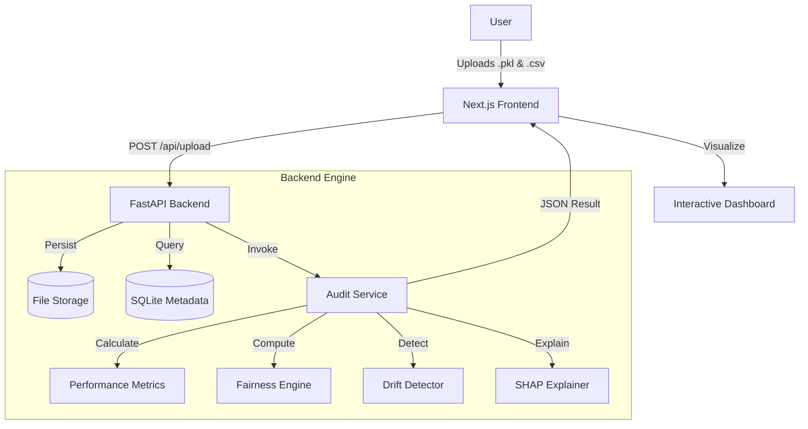

# ModelAuditAI 🛡️

<!---
ModelAuditAI - Machine Learning Audit System
Copyright (c) 2026 Sarthak Papneja
-->

**ModelAuditAI** is a production-grade machine learning audit system designed to evaluate models for **Performance, Fairness, Drift, Overfitting, and Leakage**.

Targeted at data scientists and compliance officers, it provides a unified, interactive dashboard to visualize model health, ensuring your AI systems are robust, unbiased, and regulatory-compliant.


---

## 🏗 System Architecture

ModelAuditAI operates on a decoupled client-server architecture designed for heavy computational lifting while maintaining a responsive UI.



---

## 🚀 Key Features Breakdown

### 1. Multi-Dimensional Health Scoring
The system aggregates 5 key dimensions into a single **Health Score (0-100)** to give you an instant "credit score" for your model.
- **Performance**: Standard metrics (Accuracy, F1, RMSE, R²) weighted by task type.
- **Fairness**: Checks **Demographic Parity** and **Disparate Impact Ratio** across sensitive groups (Race, Gender, Age).
- **Data Drift**: Uses **Population Stability Index (PSI)** and **Kolmogorov-Smirnov (KS) tests** to detect distribution shifts between training and inference data.
- **Overfitting**: Compares Train vs. Test scores. If the gap > 5%, overfitting warnings are triggered.
- **Leakage**: Detects features with suspicious correlation (>99%) to the target, which often indicates data leakage.

### 2. Deep Explainability (SHAP)
We integrate **SHAP (SHapley Additive exPlanations)** to provide game-theoretic feature importance. This tells you *exactly* which features are driving your model's predictions, protecting you from "black box" risks.

### 3. On-the-Fly Re-Configuration
Did you select the wrong target column? Or maybe you want to test how the model performs on a different feature?
- **No re-uploads needed**: Just go to the **Configure** tab.
- **Instant Re-Audit**: The backend re-processes the existing dataset with new parameters in seconds.

### 4. Automated Reporting
Generate compliance-ready reports in one click:
- **JSON**: Raw data for programmatic integration.
- **PDF**: A beautifully formatted, executive-level summary of the audit findings.

---

## 🛠 Tech Stack

### Frontend
- **Framework**: Next.js 14 (App Router)
- **UI & Styling**: Tailwind CSS, Shadcn UI, Framer Motion
- **Visualization**: Recharts (Customized Radar & Bar Charts)
- **State Management**: React Hooks & Context API

### Backend
- **Framework**: FastAPI (High-performance Async Python)
- **ML Core**: Scikit-learn, Pandas, NumPy, SHAP
- **PDF Generation**: FPDF2
- **Database**: SQLite (Lightweight metadata storage)

---

## ⚡ Getting Started

### Prerequisites
- Node.js 18+
- Python 3.10+

### 1. Clone & Setup Backend
```bash
cd backend
python -m venv venv
source venv/bin/activate  # On Windows: venv\Scripts\activate
pip install -r requirements.txt

# Run the server
python main.py
# Backend runs on http://localhost:8000
```

### 2. Setup Frontend
```bash
cd frontend
npm install

# Run the development server
npm run dev
# Frontend runs on http://localhost:3000
```

### 3. Run Your First Audit
1. Go to `http://localhost:3000`.
2. Upload a pickled model (`.pkl`, `.joblib`) and a dataset (`.csv`).
3. Select your **Target Column** and **Task Type** (Classification/Regression).
4. Click **Run Audit** and watch the magic happen!

---

## 📸 Screenshots

### Audit Dashboard
Visualize your model's health score and key metrics at a glance.


### Fairness Analysis
Deep dive into bias metrics for sensitive groups.


### Re-Configuration
Tweaked your settings without re-uploading files.


---

## 📄 License

This project is open-source and available under the [MIT License](LICENSE).

Copyright (c) 2026 Sarthak Papneja.
